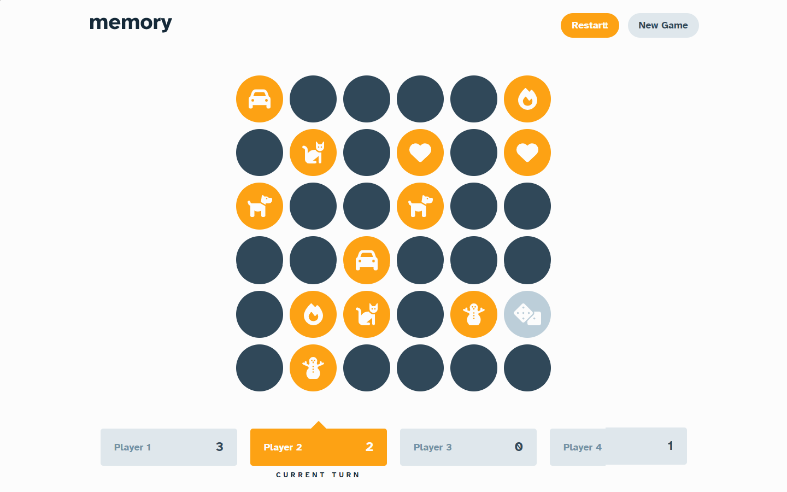
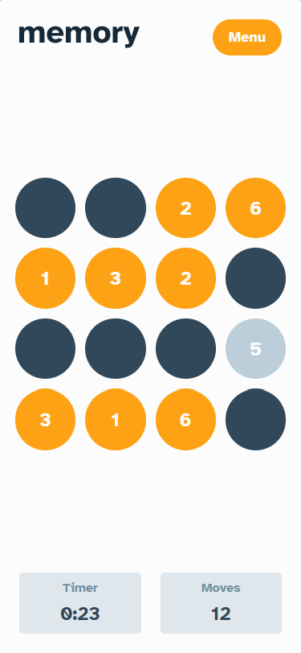

# Memory game

This is a classic Memory Game. Users are able to play the game either solo or multiplayer, set the theme to use numbers or icons within the tiles, choose to play on either a 6x6 or 4x4 grid. 

## Table of contents

- [Overview](#overview)
  - [The challenge](#the-challenge)
  - [Screenshot](#screenshot)
  - [Links](#links)
  - [Built with](#built-with)
- [Author](#author)

## Overview

### The challenge

Users should be able to:

- View the optimal layout for the game depending on their device's screen size
- See hover states for all interactive elements on the page
- Play the Memory game either solo or multiplayer (up to 4 players)
- Set the theme to use numbers or icons within the tiles
- Choose to play on either a 6x6 or 4x4 grid

### Screenshot

### Links

- Solution URL: https://github.com/Umlen/memory-game
- Live Site URL: https://prismatic-malasada-e29032.netlify.app/

### Built with

- [React] https://reactjs.org/ - JS library
- HTML5 markup
- CSS
- Flexbox
- CSS Grid
- Mobile-first workflow

## Author

- Website - http://viktorpatrin.com/
- Frontend Mentor - https://www.frontendmentor.io/profile/Umlen
